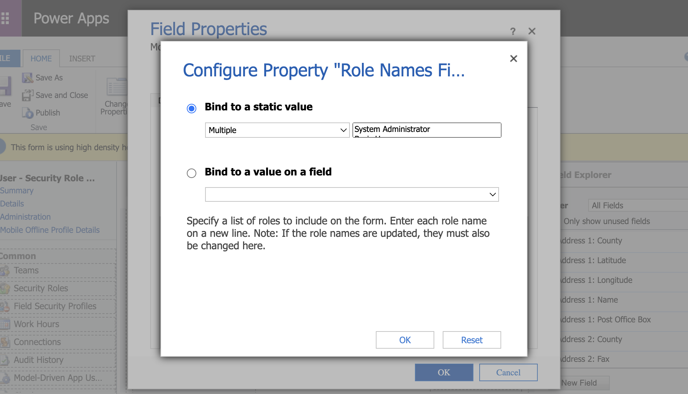

# Installation and Configuration

- Download and install a solution from the [Releases page](https://github.com/cathalnoonan/d365-pcf-securityrolemanager/releases).
- Edit the form of the User or Team entity using the classic interface.
- Add a field to the form.
  
  - This can be an unused field, or a new field.
  - The field can be any of the following field types:
    - Currency
    - DateAndTime.DateAndTime
    - DateAndTime.DateOnly
    - Decimal
    - Enum
    - FP
    - Lookup.Simple
    - Multiple
    - MultiSelectOptionSet
    - OptionSet
    - SingleLine.Email
    - SingleLine.Phone
    - SingleLine.Text
    - SingleLine.TextArea
    - SingleLine.Ticker
    - SingleLine.URL
    - TwoOptions
    - Whole.None
  - Refer to Microsoft's PCF [documentation page](https://docs.microsoft.com/en-us/powerapps/developer/component-framework/manifest-schema-reference/property#remarks) for more information about the above field types.
  - The value of this field is not read or changed by the control, it is just used as a placeholder to give the control somewhere to render.
- Open the properties of the field.
  - Set the field to not display a label (Optional, but recommended).
  
  - Open the Controls tab.
  
  - Select `Security Role Manager` under the Add Control option.
  
  - Configure the input properties for the control:
  
    - EntityId:
      - For `systemuser`, select the `systemuserid` field
      - For `team`, select the `teamid` field
      
    - EntityLogicalName:
      - Select `Bind to a static value` and type `systemuser` or `team`
      
    - BusinessUnit:
      - Select the `businessunitid` field
      
    - RoleNamesFilter (optional, added in `v2.1.0`):
      - If you would like to filter the list of roles that are shown on the form, enter the names of roles to be shown.
      - Select `Bind to a static value`, type each security role name on a new line.
      - **Note: The names must match with security role names. If roles are renamed elsewhere, they must be updated here also.**
      
- Save, Publish, Refresh the form.

---

The maker portal can be used to add the control to the form with online environments.

