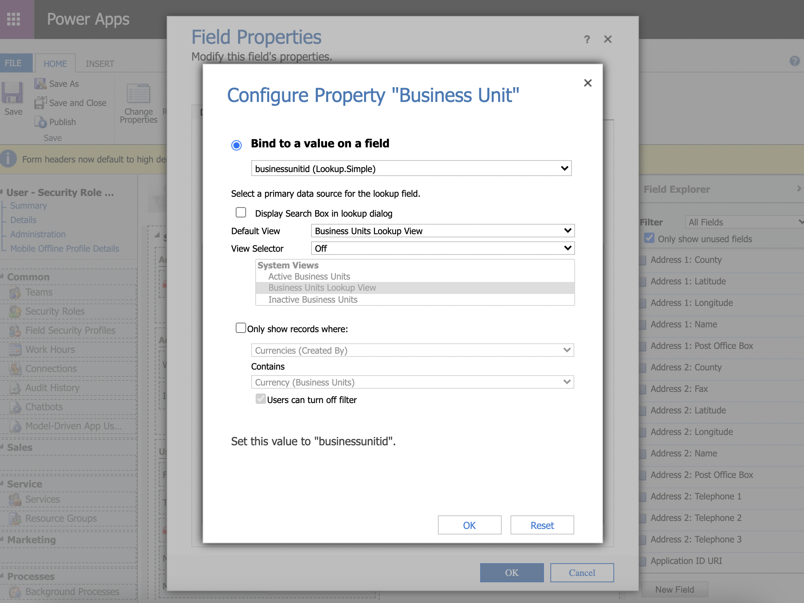

# Migration from V1 to V2

Please read these notes before deploying the V2 solution of this component

V2 adds the option to assign roles from multiple business units

> **Note:** This functionality seems to only work with the online version of D365
>
> If you are using this control in an on-premises deployment, **please stay on V1.x**

---

## Additional Configuration Required

After importing the solution from the [releases page](https://github.com/cathalnoonan/d365-pcf-securityrolemanager), open the form(s) where the field is already added

Select and double-click the control that has the control added

In the `Controls` tab, there will be additional options under the `Security Role Manager` control
- Entity ID
- Entity Logical Name
- Business Unit

These three values need to be assigned a value for the control to function properly

- Entity ID
  - This field should be bound to the primary key field of the entity; i.e. `systemuserid` or `teamid`
- Entity Logical Name
  - This field should either be a hard-coded reference to the entity name, i.e. `"systemuser"` or `"team"`\
  or else bound to the `entitylogicalname` field
- Business Unit
  - Select the `businessunitid` lookup field
  
When configuring the `Business Unit` field, there is an option to enable view searching - uncheck this

